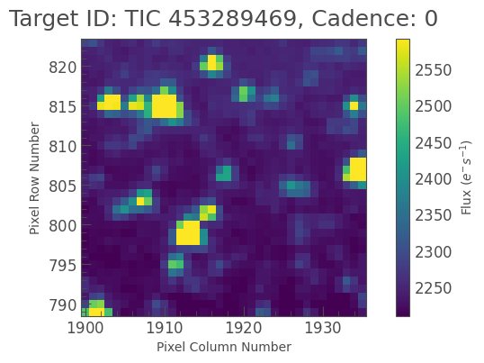
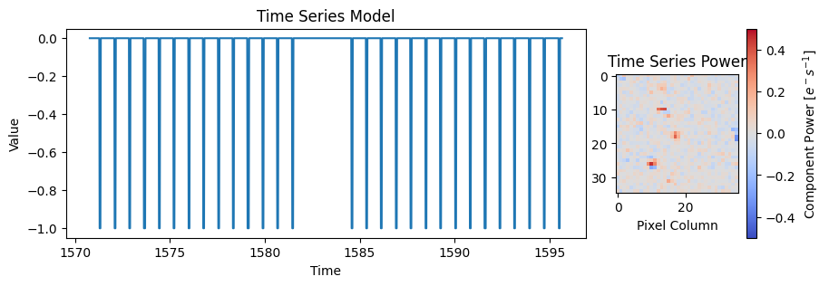

# tess-buccaneer

A cool package under construction...

## What is this?

This is an under development framework for fitting NASA TESS data to find where a given signal is coming from in the TESS FFIs, fitting for scattered light and jitter noise. 

You might use this tool by getting the data

```python
tpf = lk.search_tesscut("TIC 453289469")[0].download(cutout_size=(35, 36), quality_bitmask=175)
```
Which will look something like this


You can then build a time-series model to search for in the data, which might look like this

```python
t0 = 1652.44
period = 0.779919
duration = 1.54300/24
transitmodel = BoxTransit(period=period, t0=t0, duration=duration)
```

You can then put these in to the `TPFModel` class and fit the model

```python
tm = TPFModel(tpf)
tm.include_model(transitmodel)
tm.fit()
```

You'll then get a model for the pixel time series. You'll be able to also access the weights of your time-series model in every pixel. Those weights looks something like this:



You can see there is only weak evidence for this particular transit shape...partly because tess-buccaneer needs to be improved.


